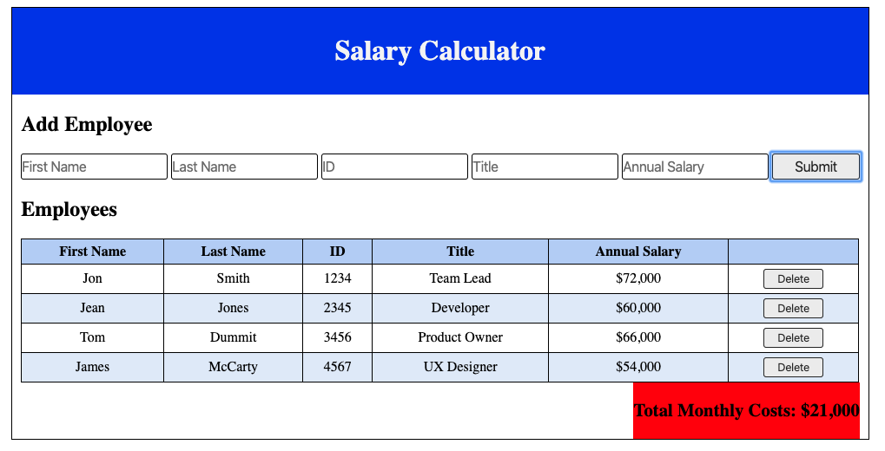

# Tier 2 Week 7 Weekend Challenge: Salary Calculator

For this challenge, I created an application that records employee salaries and adds salaries up to report total monthly costs.

[Here](./INSTRUCTIONS.md) is the link to the project instructions.

## Description

On the top part of the application, there is an input form that collects an employee's information such as _first name, last name, ID number, job title, and annual salary_.

After you entered all of the information, click the 'Submit' button which collects the input information from the form, stores the information, uses the stored information to calculate the total monthly costs, appends this information to the DOM in a table format, and clears the input fields.

The total monthly cost is displayed at the bottom of the application below the individual employees information. If the total monthly cost exceeds \$20,000, a red background color is added to the total monthly cost.

In addition,there is a 'Delete' button for each employee row. This button removes the employee row from the DOM and also removes the employ's salary from the reported total.

## Screen Shot

Below is a screenshot of the application:

